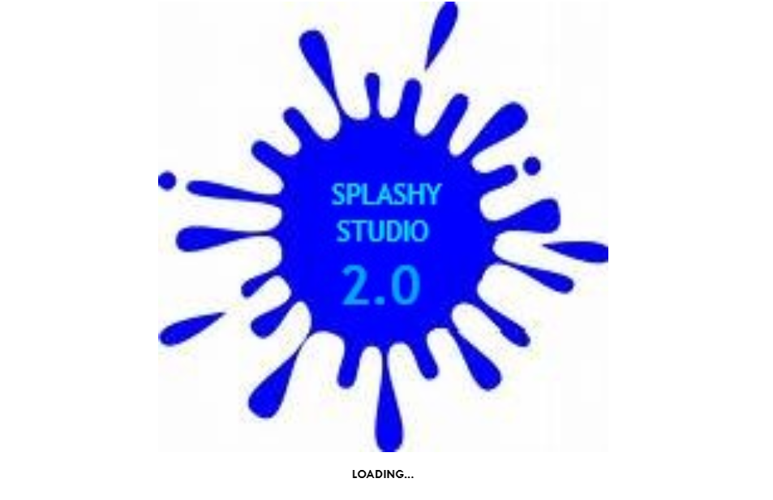
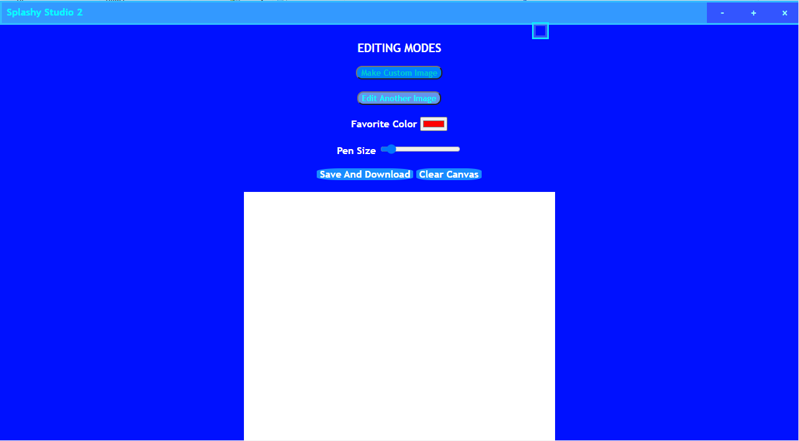
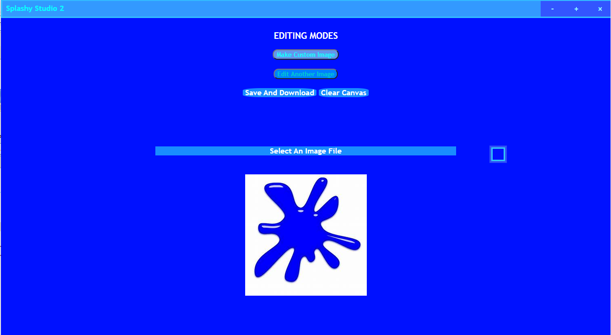

# Splashy Studio 2.0
<b>Splashy Studio 2.0</b> is a <b><i>real</i></b> comparison to <b>Splashy Studio 1.0</b> itself!
# Overview
  
#
<b><i>Again,</i></b> I <b>did not</b> add the <i>node_modules</i> folder! <b>BYE!</b>
